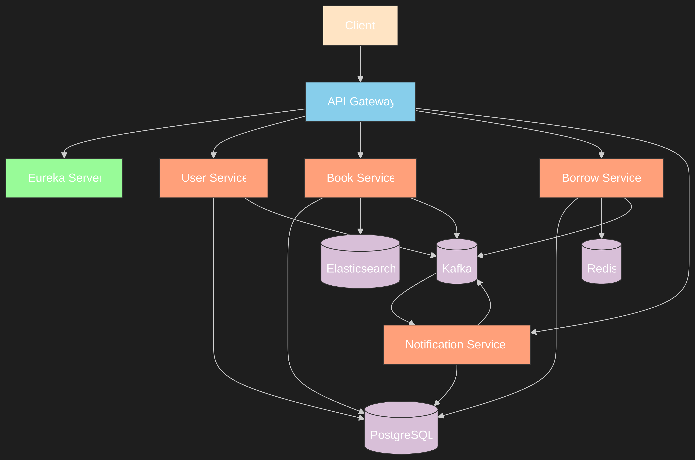

# 📚 Library Management System – Microservices Architecture

## Description
The **Library Management System** is a modern, distributed application for managing books, users, borrowing operations, and notifications.  
Built with a **Spring Boot microservices architecture**, it integrates service discovery, API gateway routing, event-driven communication with **Kafka**, and a relational database with **PostgreSQL**.  
The project is containerized with **Docker Compose** for easy deployment.

---

## Key Features
- **User Management**:
  - User registration, authentication, and role-based access control.
  - Roles: `ADMIN`, `LIBRARY_MANAGER`, `READER`.
  - CRUD operations for users.
- **Book Management**:
  - Create, update, delete, and search books by title, author, genre, or ISBN.
  - Borrow and return operations with availability tracking.
- **Borrow Service**:
  - Request, approve, complete, return, and extend borrow operations.
  - Borrow history tracking for users and books.
- **Notification Service**:
  - Send email notifications for due dates, approvals, and system alerts.
  - Retry failed notifications.
- **API Gateway**:
  - Central entry point for all client requests.
  - Circuit breaker pattern for fault tolerance.
  - Request correlation for traceability.
- **Event-Driven Communication**:
  - Kafka integration for async messaging between services.

---

## Technologies Used
- **Backend**: Java 17, Spring Boot, Spring Cloud (Eureka, Gateway, Circuit Breaker)
- **Database**: PostgreSQL
- **Messaging**: Apache Kafka, Zookeeper
- **DevOps**: Docker, Docker Compose
- **Tools**: Maven, Swagger/OpenAPI

---

## Project Structure
```
library-management/
├── api-gateway/               # API Gateway service
├── bookservice/               # Book Service
├── borrowservice/             # Borrow Service
├── eureka-server/              # Service Discovery
├── notificationservice/       # Notification Service
├── user-service/              # User & Authentication Service
├── docker-compose.yml         # Docker orchestration
├── mermaid_diagram_*.png      # Architecture diagram
└── README.md                  # Documentation
```

---

## Architecture Diagram


---

## Installation 🚀

### Prerequisites
- **Java**: JDK 17 or higher
- **Docker**: For containerization
- **PostgreSQL**: For local DB setup (if running outside Docker)
- **Maven**: For building microservices
- **Git**: For version control

---

### Setup Instructions

#### 1. Clone the Repository
```bash
git clone https://github.com/asseBadiane/Library-Management.git
cd Library-Management
```

#### 2. Run with Docker Compose
From the root directory:
```bash
docker-compose up --build
```

This starts:
- PostgreSQL
- Zookeeper
- Kafka
- Eureka Server
- API Gateway
- User Service
- Book Service
- Borrow Service
- Notification Service

#### 3. Access the Services
- **Eureka Dashboard** → [http://localhost:8761](http://localhost:8761)  
- **API Gateway** → [http://localhost:8081](http://localhost:8081)  
- **User Service** → [http://localhost:8082](http://localhost:8082)  
- **Book Service** → [http://localhost:8083](http://localhost:8083)  
- **Borrow Service** → [http://localhost:8084](http://localhost:8084)  
- **Notification Service** → [http://localhost:8085](http://localhost:8085)  

---

## API Endpoints

### Authentication
| Method | Endpoint             | Description                |
|--------|----------------------|----------------------------|
| POST   | `/api/auth/register` | Register a new user        |
| POST   | `/api/auth/login`    | Authenticate and get token |

### User Management
| Method | Endpoint             | Description                     |
|--------|----------------------|---------------------------------|
| GET    | `/api/users`         | List users (Admin/Manager only) |
| GET    | `/api/users/{id}`    | Get user by ID                  |
| PUT    | `/api/users/{id}/role` | Update user role               |
| DELETE | `/api/users/{id}`    | Deactivate user                 |

### Book Management
| Method | Endpoint                     | Description           |
|--------|------------------------------|-----------------------|
| POST   | `/api/books`                  | Add a new book        |
| GET    | `/api/books`                  | List all books        |
| PUT    | `/api/books/{id}`             | Update book details   |
| DELETE | `/api/books/{id}`             | Delete a book         |
| POST   | `/api/books/{id}/borrow`      | Borrow a book         |
| POST   | `/api/books/{id}/return`      | Return a book         |

### Borrow Management
| Method | Endpoint                     | Description                |
|--------|------------------------------|----------------------------|
| POST   | `/api/borrows/request`        | Request to borrow a book   |
| POST   | `/api/borrows/approve`        | Approve borrow request     |
| GET    | `/api/borrows/user/{userId}`  | User borrow history        |
| GET    | `/api/borrows/book/{bookId}`  | Book borrow history        |

### Notification Management
| Method | Endpoint                       | Description                |
|--------|--------------------------------|----------------------------|
| POST   | `/api/notifications`           | Create notification        |
| POST   | `/api/notifications/{id}/send` | Send specific notification |
| GET    | `/api/notifications/user/{id}` | Notifications by user      |

---

## Development

### Run a Service Locally
Example for **Book Service**:
```bash
cd bookservice
mvn clean install
mvn spring-boot:run
```

### Run Tests
```bash
mvn test
```

---

## Contribution
1. Fork the repository.
2. Create a feature branch (`git checkout -b feature/YourFeature`).
3. Commit your changes (`git commit -m 'Add YourFeature'`).
4. Push to the branch (`git push origin feature/YourFeature`).
5. Open a Pull Request.

---

## License
This project is licensed under the **Apache 2.0 License** – see the [LICENSE](LICENSE) file for details.

---

*"A library is not just a place for books, it's a gateway to knowledge — and now, it's in the cloud!"* 🚀
